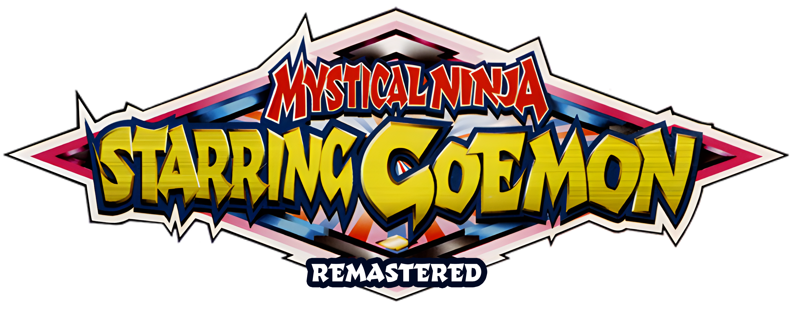
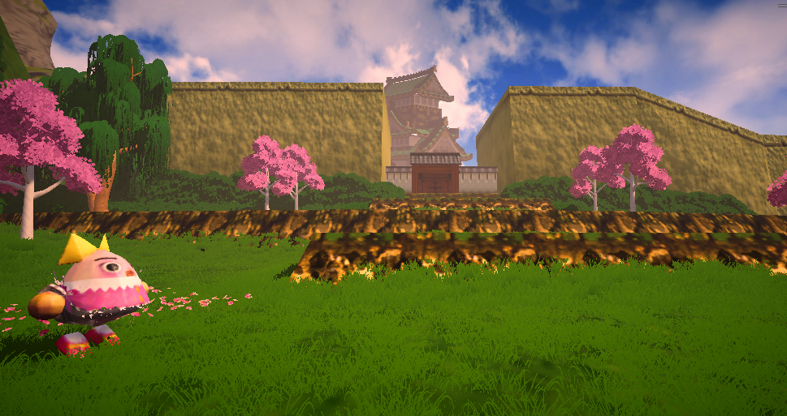

# Goemon64Remastered

A modern remake / remaster of Mystical Ninja Starring Goemon. Using a unique ROM memory extraction approach, it aims to recreate the gameplay 1:1 with modern graphics, controls, camera and other enhancements so that new players and fans alike can enjoy a new version of the game but still enjoy what made the original great. Requires ROM.

Note: Due to the nature of this project and what it is and does, it's NOT open source. This repo is purely for reporting issues, downloading the game, seeing the documentation and making suggestions for game improvement.

Download our releases from 'Releases' on Github. We mostly will post direct links from our parent domain, spacefarergames.com as Github can sometimes struggle with large file downloads.

Goemon 64 Remastered is a ground‑up Unity re‑implementation that uses the original N64 ROM as a live data source. Geometry are streamed directly from memory, then reconstructed with modern rendering, physics, and cinematics. The result is a faithful yet dramatically enhanced version of the classic—preserved at the byte level, but presented with contemporary polish.

🧠 ROM‑Driven Authenticity

The original level layouts, collision, enemy placements, and event triggers are parsed directly from the ROM at runtime.
Ensures pixel‑accurate spatial fidelity—every slope, platform, and secret matches the original game’s data.
Scripted sequences and gameplay logic are mirrored from the original instruction flow, guaranteeing authentic behavior while allowing modern overrides.

🎨 Modern Rendering Pipeline

Fully rebuilt environments using high‑resolution meshes, PBR materials, and dynamic lighting while maintaining the original artistic intent.
Volumetric fog, real‑time shadows, and post‑processing give each area a richer sense of atmosphere.

🎬 Recreated Cutscenes & Cinematics

All story sequences are reconstructed shot‑for‑shot using Unity’s Timeline and Cinemachine.
Camera paths, character blocking, and timing are derived from the original ROM data, then enhanced with:
Modern lighting
Facial animation passes
Higher‑fidelity character rigs
The result: cinematics that feel exactly like you remember, but look like they were made today.

🎮 Modernized Controls & Camera

A new input abstraction layer maps classic actions to modern controllers with responsive analog movement.
Camera with smoother rotation, better framing, and reduced friction—while still allowing purist mode for original behavior.
Improved collision and physics smoothing eliminates legacy quirks without altering intended gameplay.

🔊 Audio Enhancements

Original audio cues are streamed and remapped into Unity’s audio mixer for cleaner spatialization and dynamic mixing..

🧩 Hybrid Preservation Architecture

The game runs on a dual‑layer system:
Core Layer: Original ROM logic, data tables, and event flow.
Presentation Layer: Unity‑based rendering, animation, UI, and QoL systems.
This ensures perfect gameplay authenticity with the freedom to add modern enhancements safely and non‑destructively.

📈 Quality‑of‑Life Improvements

Rebuilt UI with crisp vector‑style elements and scalable layouts.
Faster load transitions, checkpoint smoothing, and optional accessibility toggles.
Optional debug and analysis tools for preservationists and speedrunners.

🌏 A Faithful Reconstruction with Modern Soul

This remaster doesn’t emulate—it reimagines the original data through a modern engine, preserving the exact structure of the classic while giving it the lighting, clarity, and expressiveness it always deserved.

Supported Platforms
Windows 10/11 (64bit)
Linux (64bit)
macOS (64bit)
Nintendo Switch (NSP, Requires custom firmware / Dev Kit and does not run on retail)

Why did we make this?

Because we love the game, and wanted to give it a modern take so new players and fans alike can experience it in a more modern way but retain the original gameplay.

What do I need to play it?
A modern PC will suffice from 2020 onwards, with Windows 10/11 or supported OS that a build is for. 
You can also run this on Nintendo Switch development hardware or custom firmware.

How can I report a problem or suggest a feature?
Simple, email as at jake@spacefarergames.com or visit our Discord.We are also active on the Ganbare Goemon Server.

You will also need a USA or PAL ROM from the N64 legally obtained from your own copy. 

Currently, we support (SHA must match)

USA - 809E198DAA4A494793575971488C95146C49576F 
EU-
A1E964F6583A85B13FD40D83B008638A07CD7658 

JAP is supported technically but crashes, so don't use it for now.
